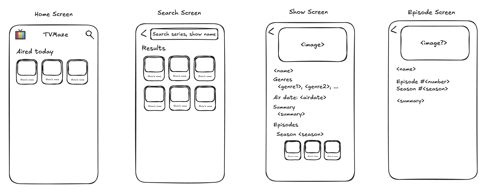

#  TVMaze

## Mockup

## Demo

## Architecture

- SwiftUI
- MVVM-C
  - Coordinator here is responsible to resolve the route. The navigation is done using NavigationStack + NavigationLinks

## Features

- [x] List all of the series contained in the API used by the paging scheme provided by the API.
- [x] Allow users to search series by name.
- [x] The listing and search views must show at least the name and poster image of the
series.
- [x] After clicking on a series, the application should show the details of the series, showing
the following information:
  - Name
  - Poster
  - Days and time during which the series airs
  - Genres
  - Summary
  - List of episodes separated by season
- [x] After clicking on an episode, the application should show the episode’s information, including:
  - Name
  - Number
  - Season
  - Summary
  - Image, if there is one
  
## Tests

### Unit
The critical business logic was tested, including
- [x] HttpClient
- [x] Response->Domain Adapters
- [x] Coordinators
- [x] ViewModels

### UI
The critical flows and actions were tested, including screens
- [x] Home
- [x] Search
- [x] ShowDetail
- [x] Episode

## Libraries
- RichText: Used to gracefully renders `summary` HTML text retrieved from TVMaze API.
